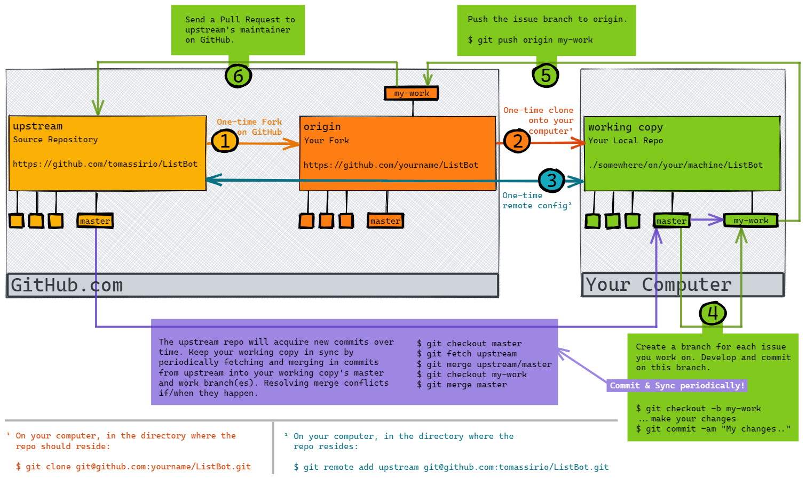

## How To Contribute

Thank you for wanting to contribute to ListBot!

To start, please visit and read our [Contributor Code of Conduct](./CODE_OF_CONDUCT.md).

Welcome back! If you agree to abide by the [Contributor Code of Conduct](./CODE_OF_CONDUCT.md) continue below, where you'll find an overview of the contributor workflow, contributor Dos & Don'ts, and a checklist for developers wanting to contribute to ListBot.

## At A Glance

Here is a pictoral overview of the contributor workflow.



## Basic Contributor Workflow

Below is a step-by-step guide to the contributor workflow.

1. Fork the [ListBot repo on GitHub](https://github.com/tomassirio/ListBot)

2. Clone the fork to your local machine.

    ```
    $ git clone git@github.com:username/ListBot.git
    ```

3. Set up a remote `upstream` so that you can keep up-to-date with the source repository changes.

    ```
    $ git remote add upstream git@github.com:tomassirio/ListBot.git
    ```

    You can verify you've set up the remote correctly by running the following command which will list the remote names and URLs:

    ```
    $ git remote -v
    ```

    You should see output similar to the following:

    ```
    upstream        git@github.com:tomassirio/ListBot.git (fetch)
    upstream        git@github.com:tomassirio/ListBot.git (push)
    ```

4. Create a specific feature branch to develop on (be sure to branch off your up-to-date master branch):

    ```
    $ git checkout -b ###-short-description-of-issue
    ```

    The `###` in the branch name should match the number assigned to [an open issue ticket within the ListBot repo on GitHub](https://github.com/tomassirio/ListBot/issues). For example, if you were working on Issue #142, the branch you create for your work might be named `142-improve-contributor-docs`

5. Edit and test the changes on your development machine.

6. Merge the upstream master branch (and fix any conflicts)

    ```
    $ git fetch upstream
    $ git checkout master
    $ git merge upstream/master
    $ git checkout ###-short-description-of-issue
    # [make sure all is committed as necessary in branch before merging]
    $ git merge master
    ```

    Get in the habit of continually incorporating changes from the upstream master to keep your master up-to-date.

7. Perform final testing and run `npm run lint` to ensure there are no linting issues in your working branch.

8. Push your issue branch up to your (origin) fork.

    ```
    git push origin ###-short-description-of-issue
    ```

9. Issue a Pull Request on GitHub.

## Pull Request Checklist

-   Before issuing a pull request be sure that you have: 1) incorporated the current state of the upstream master into your issue branch, 2) checked your code against the linter, and 3) tested ListBot with your changes in place.

-   As of this writing, there are no automated tests in the codebase. This means you have to be diligent to ensure everything is in working order after making changes. You'll do this by manually testing ListBot before issuing your pull request. This isn't ideal, and there is [an open issue for getting tests in place](https://github.com/tomassirio/ListBot/issues/53) (help with that if you're able).

-   If you're adding a new feature, document how to test it in a PR comment. This is another stopgap until automated testing is in place, and at that time new features will require new automated tests exist as part of the pull request changes.

## Dos and Don'ts

-   Don't develop on the master branch

-   Do create development branches for each issue you are working on

-   Do keep each development branch related to a single issue — do not mixes fixes with features or unrelated fixes with other fixes; Open a new issue if you need to

-   Do keep config files clean (like .gitignore for example) — don't add test files that are specific to your setup

## What To Contribute

-   Browse [the list of issues in the repo](https://github.com/tomassirio/ListBot/issues) and see if there is something you are interested in working on
-   Or if you discover an issue with the bot or its documentation here open a new issue. If you're willing and able to fix the issue, note that in your submission.
